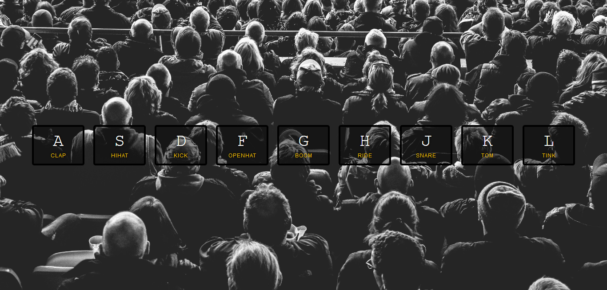

# Day 01 - JavaScript Drum Kit ✅

**Date:** 04/27/2020

I'm really happy with this first day! I learned new things and because of it I'm so excited.



## About HTML:

Today I learned the HTML tag: `<kbd>`.

According to the [w3Schools](https://www.w3schools.com/tags/tag_kbd.asp), it's use to define a keyboard input. In this case, we use to structure our HTML code with letter we will use to play our Drum Kit:

```html
 <kbd>A</kbd>
```

Another things that I learned it was the the attribute `data-*`. Again according to [w3Schools](https://www.w3schools.com/tags/att_global_data.asp):

> The data-* attributes is used to store custom data private to the page or application.

> The data-* attributes gives us the ability to embed custom data attributes on all HTML elements.

In our case, we use to customize the `<div>` with the key code number attribute:

```html
    <div data-key="65" class="key">
        <kbd>A</kbd>
        <span class="sound">clap</span>
    </div>
```

## About CSS

I transformed it in a responsive layout with `flex`. 😁

## About JavaScript

He used the HTML attribute `data-key` to select the tag audio and key code number:

```javascript
    const audio = document.querySelector(`audio[data-key="${e.keyCode}"]`);
    const key = document.querySelector(`.key[data-key="${e.keyCode}"]`);
```

Then it was necessary to eleminate the keys we don't use:

```javascript
    if(!audio) return;
```

I never imagined that it was possible to use `return` on this way. If the key pressed it wasn't our pattern keys, this return nothing.

About the delay key problem, he set the `currentTime` to `0`:

```javascript
    audio.currentTime = 0;
```

And then we can play it!

```javascript
    audio.play();
```

To give a funny animation interaction, he added a CSS class, that was ready on the started-files.

```javascript
    key.classList.add('playing');
```

Ok! We can have a funniest play it! But we have some problems here. When we press the keydown and we take our fingers and we have the keyup moviment, the previous animation doesn't disappear. 

To solve it, Wes selected all classes `.key`, he ran through an array to take the `transitionend` event listener, which show us when transition aninmation ends.

With this information, we can take the property name to discover when to remove the animation `.playing` class:

```javascript

    function removeTransition(e) {
        if(e.propertyName !== 'transform') return;
        this.classList.remove('playing');
    }

    const keys = document.querySelectorAll('.key');
    keys.forEach(key => key.addEventListener('transitionend', removeTransition));
```

That's all folks! 😃

Thanks WesBos to share this with us! 💖

## About my adjustments on it

I'm trying to transform it in a clickable application to be used on the cell phone. 😁

**05/08/2020:** Now is clickable!

---

written by [@vanribeiro](https://github.com/vanribeiro).