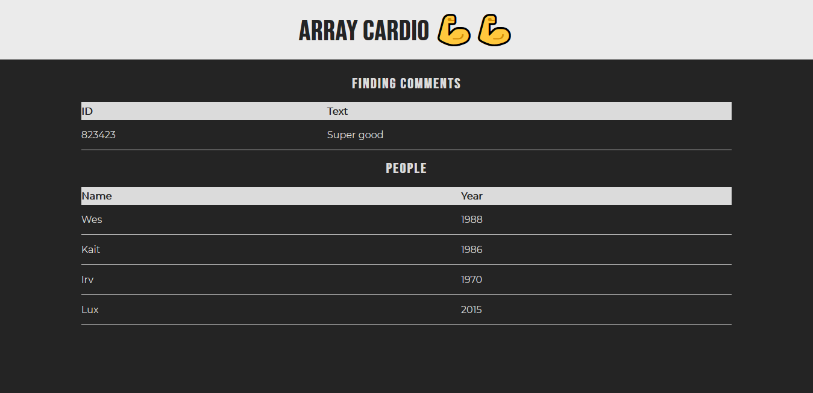

# Day 06 - Array Cardio Day 02 💪💪 ✅

**Date:** 05/05/2020



## About HTML and CSS

I tried to do the same thing with I did on the [Array Cardio Day 01](./../04%20-%20Array%20Cardio%20Day%201/README.md) but I didn't get success. But the important is I learned JavaScript things, which is the aim on this challenge.

## About JavaScript

About this array cardio, I learned 04 new methods:

### Some Person is an Adult

Wes used [`some()` method](https://developer.mozilla.org/en-US/docs/Web/JavaScript/Reference/Global_Objects/Array/some) to discover whether one set of people would have some adult person. According the [MDN site](https://developer.mozilla.org/en-US/docs/Web/JavaScript/Reference/Global_Objects/Array/some):

> The [`some()`](https://developer.mozilla.org/en-US/docs/Web/JavaScript/Reference/Global_Objects/Array/some) method tests whether at least one element in the array passes the test implemented by the provided function. It returns a Boolean value. 

```javascript
const isAdult = people.some((person) => {
    const currentYear = (new Date()).getFullYear();
    return currentYear - person.year >= 19;
})
```

### Every Person is an Adult

Wes used [`every()` method](https://developer.mozilla.org/en-US/docs/Web/JavaScript/Reference/Global_Objects/Array/every) to discover whether every person in one set of people would be an adult. According [MDN](https://developer.mozilla.org/en-US/docs/Web/JavaScript/Reference/Global_Objects/Array/every):

> The [`every()`](https://developer.mozilla.org/en-US/docs/Web/JavaScript/Reference/Global_Objects/Array/every) method tests whether all elements in the array pass the test implemented by the provided function. It returns a Boolean value.

```javascript
const allAdult = people.every((person) => {
    const currentYear = (new Date()).getFullYear();
    return currentYear - person.year >= 19;
});
```

### Finding the Comment

Wes used the [`find()` method](https://developer.mozilla.org/en-US/docs/Web/JavaScript/Reference/Global_Objects/Array/find) to find one determined comment. According to [MDN site](https://developer.mozilla.org/en-US/docs/Web/JavaScript/Reference/Global_Objects/Array/find):

> The [`find()`](https://developer.mozilla.org/en-US/docs/Web/JavaScript/Reference/Global_Objects/Array/find) method returns the value of the first element in the provided array that satisfies the provided testing function.

[`find()`](https://developer.mozilla.org/en-US/docs/Web/JavaScript/Reference/Global_Objects/Array/find) is similar to [`filter()`](https://developer.mozilla.org/en-US/docs/Web/JavaScript/Reference/Global_Objects/Array/filter). The difference between them is that [`find()`](https://developer.mozilla.org/en-US/docs/Web/JavaScript/Reference/Global_Objects/Array/find) returns the first value found and [`filter()`](https://developer.mozilla.org/en-US/docs/Web/JavaScript/Reference/Global_Objects/Array/filter) returns all values related that was found.

This is Wes code using [`find()`](https://developer.mozilla.org/en-US/docs/Web/JavaScript/Reference/Global_Objects/Array/find):

```javascript
const comment = comments.find((comment) => {
    return comment.id === 823423;
});
```

### Find The Index Comment

Wes used the `findIndex() method` to find the index position of value search in the array comments. According to [MDN Site](https://developer.mozilla.org/en-US/docs/Web/JavaScript/Reference/Global_Objects/Array/findIndex):

> The [`findIndex()`](https://developer.mozilla.org/en-US/docs/Web/JavaScript/Reference/Global_Objects/Array/findIndex) method returns the index of the first element in the array that satisfies the provided testing function. Otherwise, it returns -1, indicating that no element passed the test.

```javascript
const index = comments.findIndex((comment) => {
    return comment.id === 823423;
});
```

## Conclusion

I finish this day knowing that I have a lot of things to learn about front-end!
😊💖

You can see final result [here](https://vanribeiro-30daysofjavascript.netlify.app/challenge-files/07%20-%array%20cardio%20day%202/). 😃😉😍

That's all folks! 😃

Thanks [WesBos](https://github.com/wesbos) to share this with us! 😊💖

---

written by [@vanribeiro](https://github.com/vanribeiro).